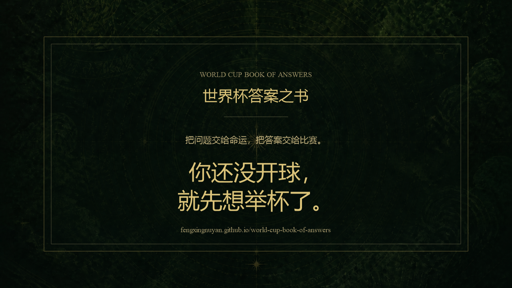

# 世界杯答案之书

一个世界杯主题的 `The Book of Answers` 静态网页实验。

用户写下一个问题，点击“开球”，页面会以一句带有足球语感、但保持留白和联想空间的短答案回应你。

适合做两件事：

- 在世界杯语境里做轻互动传播
- 作为后续继续扩展产品、文案和视觉设计的 MVP 底稿

## 项目预览

在线体验：

`https://fengxingnuyan.github.io/world-cup-book-of-answers/`

## 这个项目有什么

- 世界杯主题答案语料库
- 问题页 / 答案页双页体验
- 空输入时的隐藏式回答逻辑
- 按北京时间计算的每日 5 次使用限制
- 保存答案卡图片
- 适配多设备的流式布局
- 偏古书封面的视觉边框与金色书页气质

## 怎么玩

1. 打开页面
2. 写下你的问题，或者什么都不写
3. 点击“开球”
4. 接受一句像答案、但不把答案说死的话

## 设计方向

这个版本不是“知识问答”，而是“命运投射”。

所以答案的原则不是解释，不是分析，也不是预测比分，而是：

- 尽量短
- 尽量模糊
- 尽量中性
- 让用户能把自己的处境投射进去
- 让足球语境成为隐性的情绪放大器

## 本地运行

这是一个无依赖静态项目，不需要安装任何包。

直接用浏览器打开 [index.html](/C:/Users/DY/Documents/world%20cup/index.html) 即可。

## 发布到 GitHub Pages

1. 新建一个 GitHub 仓库
2. 把当前项目推上去
3. 在仓库 `Settings -> Pages` 中选择 `Deploy from a branch`
4. 分支选择 `main`，目录选择 `/ (root)`
5. 保存后等待 GitHub 自动发布

## 项目结构

- [index.html](/C:/Users/DY/Documents/world%20cup/index.html)：页面结构
- [style.css](/C:/Users/DY/Documents/world%20cup/style.css)：视觉样式与响应式布局
- [app.js](/C:/Users/DY/Documents/world%20cup/app.js)：交互逻辑、抽签逻辑、每日次数限制、图片导出
- [answers.js](/C:/Users/DY/Documents/world%20cup/answers.js)：答案语料库

## 接下来可以继续做什么

- 补一张项目截图，用于 GitHub 首页展示
- 补真实线上地址，方便微信里直接打开
- 增加微信传播所需的封面图、标题和简介
- 继续扩充答案语料，并按赛事节点迭代当届梗池

## License

如果你准备公开传播，建议补一个明确的 License。

如果暂时只是个人项目，可以先保留为未声明状态，后续再决定。
